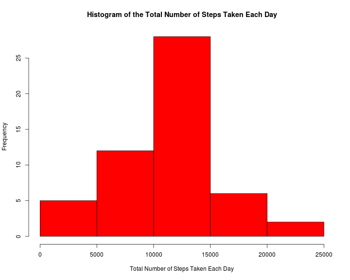
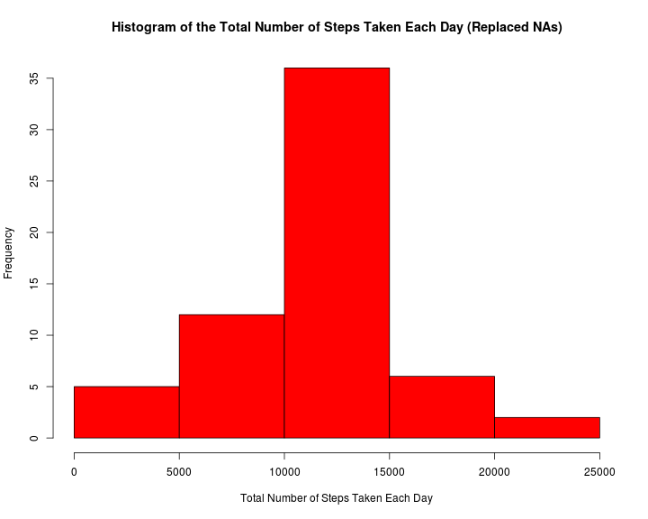

# Reproducible Research: Peer Assessment 1

## I. Loading and preprocessing the data
### 1. Load the data (i.e. read.csv())

```r
repdata <- read.csv("activity.csv")
```

### 2. Process/transform the data (if necessary) into a format suitable for your analysis
Remove NA steps and ensure the correct data types are used.

```r
repdata_clean <- repdata[!is.na(repdata$steps), ]
repdata_clean$date <- as.Date(repdata_clean$date)
repdata_clean$steps <- as.numeric(repdata_clean$steps)
```

<br/>
## II. What is mean total number of steps taken per day?
### 1. Make a histogram of the total number of steps taken each day

```r
# draw histogram
hist(with(repdata_clean, tapply(steps, date, sum)), main = paste("Histogram of the Total Number of Steps Taken Each Day"), 
    xlab = paste("Total Number of Steps Taken Each Day"), col = "red")
```

 

### 2. Calculate and report the mean and median total number of steps taken per day

```r
# mean
with(repdata_clean, tapply(steps, date, mean))
```

```
## 2012-10-02 2012-10-03 2012-10-04 2012-10-05 2012-10-06 2012-10-07 
##     0.4375    39.4167    42.0694    46.1597    53.5417    38.2465 
## 2012-10-09 2012-10-10 2012-10-11 2012-10-12 2012-10-13 2012-10-14 
##    44.4826    34.3750    35.7778    60.3542    43.1458    52.4236 
## 2012-10-15 2012-10-16 2012-10-17 2012-10-18 2012-10-19 2012-10-20 
##    35.2049    52.3750    46.7083    34.9167    41.0729    36.0938 
## 2012-10-21 2012-10-22 2012-10-23 2012-10-24 2012-10-25 2012-10-26 
##    30.6285    46.7361    30.9653    29.0104     8.6528    23.5347 
## 2012-10-27 2012-10-28 2012-10-29 2012-10-30 2012-10-31 2012-11-02 
##    35.1354    39.7847    17.4236    34.0938    53.5208    36.8056 
## 2012-11-03 2012-11-05 2012-11-06 2012-11-07 2012-11-08 2012-11-11 
##    36.7049    36.2465    28.9375    44.7326    11.1771    43.7778 
## 2012-11-12 2012-11-13 2012-11-15 2012-11-16 2012-11-17 2012-11-18 
##    37.3785    25.4722     0.1424    18.8924    49.7882    52.4653 
## 2012-11-19 2012-11-20 2012-11-21 2012-11-22 2012-11-23 2012-11-24 
##    30.6979    15.5278    44.3993    70.9271    73.5903    50.2708 
## 2012-11-25 2012-11-26 2012-11-27 2012-11-28 2012-11-29 
##    41.0903    38.7569    47.3819    35.3576    24.4688
```

```r

# median
with(repdata_clean, tapply(steps, date, median))
```

```
## 2012-10-02 2012-10-03 2012-10-04 2012-10-05 2012-10-06 2012-10-07 
##          0          0          0          0          0          0 
## 2012-10-09 2012-10-10 2012-10-11 2012-10-12 2012-10-13 2012-10-14 
##          0          0          0          0          0          0 
## 2012-10-15 2012-10-16 2012-10-17 2012-10-18 2012-10-19 2012-10-20 
##          0          0          0          0          0          0 
## 2012-10-21 2012-10-22 2012-10-23 2012-10-24 2012-10-25 2012-10-26 
##          0          0          0          0          0          0 
## 2012-10-27 2012-10-28 2012-10-29 2012-10-30 2012-10-31 2012-11-02 
##          0          0          0          0          0          0 
## 2012-11-03 2012-11-05 2012-11-06 2012-11-07 2012-11-08 2012-11-11 
##          0          0          0          0          0          0 
## 2012-11-12 2012-11-13 2012-11-15 2012-11-16 2012-11-17 2012-11-18 
##          0          0          0          0          0          0 
## 2012-11-19 2012-11-20 2012-11-21 2012-11-22 2012-11-23 2012-11-24 
##          0          0          0          0          0          0 
## 2012-11-25 2012-11-26 2012-11-27 2012-11-28 2012-11-29 
##          0          0          0          0          0
```


## III. What is the average daily activity pattern?
### 1. Make a time series plot (i.e. type = "l") of the 5-minute interval (x-axis) and the average number of steps taken, averaged across all days (y-axis)

```r
# create a temporary data frame
interval_ts <- as.data.frame(with(repdata_clean, tapply(steps, interval, mean)))
interval_ts$interval <- rownames(interval_ts)
colnames(interval_ts) <- c("average_steps", "interval")
# plot the time series analysis
plot(interval_ts$interval, interval_ts$average_steps, type = "l", ylab = paste("Average Number of Steps"), 
    xlab = paste("5-minute Interval Label"))
```

 

### 2. Which 5-minute interval, on average across all the days in the dataset, contains the maximum number of steps?

```r
interval_ts[interval_ts$average_steps == max(interval_ts$average_steps), ]
```

```
##     average_steps interval
## 835         206.2      835
```


## IV. Inputing missing values
### 1. Calculate and report the total number of missing values in the dataset (i.e. the total number of rows with NAs)
Number of NA's for 'steps' is 2304.

```r
summary(repdata)
```

```
##      steps               date          interval   
##  Min.   :  0.0   2012-10-01:  288   Min.   :   0  
##  1st Qu.:  0.0   2012-10-02:  288   1st Qu.: 589  
##  Median :  0.0   2012-10-03:  288   Median :1178  
##  Mean   : 37.4   2012-10-04:  288   Mean   :1178  
##  3rd Qu.: 12.0   2012-10-05:  288   3rd Qu.:1766  
##  Max.   :806.0   2012-10-06:  288   Max.   :2355  
##  NA's   :2304    (Other)   :15840
```

### 2. Devise a strategy for filling in all of the missing values in the dataset. The strategy does not need to be sophisticated. For example, you could use the mean/median for that day, or the mean for that 5-minute interval, etc.
Use the average number of steps for that interval.  If it is a weekday, use the weekday average.  If it is a weekend, use the weekend average.

```r
# separate repdata_clean into two data frames (weekdays and weekends)
repdata_clean_weekend <- repdata_clean[(weekdays(repdata_clean$date) == "Saturday" | 
    weekdays(repdata_clean$date) == "Sunday"), ]
repdata_clean_weekday <- repdata_clean[!(weekdays(repdata_clean$date) == "Saturday" | 
    weekdays(repdata_clean$date) == "Sunday"), ]
# calculate interval averages
interval_ts_weekend <- as.data.frame(with(repdata_clean_weekend, tapply(steps, 
    interval, mean)))
interval_ts_weekday <- as.data.frame(with(repdata_clean_weekday, tapply(steps, 
    interval, mean)))
interval_ts_weekend$interval <- rownames(interval_ts_weekend)
interval_ts_weekday$interval <- rownames(interval_ts_weekday)
colnames(interval_ts_weekday) <- c("average_steps", "interval")
colnames(interval_ts_weekend) <- c("average_steps", "interval")
# remove unnecessary objects
rm(repdata_clean_weekend)
rm(repdata_clean_weekday)
```

### 3. Create a new dataset that is equal to the original dataset but with the missing data filled in.

```r
repdata_clean_with_no_na <- repdata
repdata_clean_with_no_na$date <- as.Date(repdata_clean_with_no_na$date)
trim <- function(x) {
    gsub("(^[[:space:]]+|[[:space:]]+$)", "", x)
}
repdata_clean_with_no_na$interval <- as.numeric(trim(repdata_clean_with_no_na$interval))
removeNAs <- function(x) {
    if (is.na(x["steps"])) {
        if (weekdays(as.Date(x["date"])) == "Saturday" | weekdays(as.Date(x["date"])) == 
            "Sunday") {
            x["steps"] = interval_ts_weekend[interval_ts_weekend["interval"] == 
                as.numeric(x["interval"]), ]["average_steps"][1]
        } else {
            x["steps"] = interval_ts_weekday[interval_ts_weekday["interval"] == 
                as.numeric(x["interval"]), ]["average_steps"][1]
        }
    }
    return(x)
}
repdata_clean_no_na_result <- apply(repdata_clean_with_no_na, 1, removeNAs)
repdata_clean_no_na_final <- do.call(rbind.data.frame, repdata_clean_no_na_result)
# turn factor back to into numeric, dates
repdata_clean_no_na_final$steps <- as.numeric(as.character(repdata_clean_no_na_final$steps))
repdata_clean_no_na_final$date <- as.Date(as.character(repdata_clean_no_na_final$date))
```

### 4. Make a histogram of the total number of steps taken each day and Calculate and report the mean and median total number of steps taken per day. Do these values differ from the estimates from the first part of the assignment? What is the impact of imputing missing data on the estimates of the total daily number of steps?

```r
# draw histogram
hist(with(repdata_clean_no_na_final, tapply(steps, date, sum)), main = paste("Histogram of the Total Number of Steps Taken Each Day (Replaced NAs)"), 
    xlab = paste("Total Number of Steps Taken Each Day"), col = "red")
```

 


```r
# mean with replaced NAs
with(repdata_clean_no_na_final, tapply(steps, date, mean))
```

```
## 2012-10-01 2012-10-02 2012-10-03 2012-10-04 2012-10-05 2012-10-06 
##    35.3380     0.4375    39.4167    42.0694    46.1597    53.5417 
## 2012-10-07 2012-10-08 2012-10-09 2012-10-10 2012-10-11 2012-10-12 
##    38.2465    35.3380    44.4826    34.3750    35.7778    60.3542 
## 2012-10-13 2012-10-14 2012-10-15 2012-10-16 2012-10-17 2012-10-18 
##    43.1458    52.4236    35.2049    52.3750    46.7083    34.9167 
## 2012-10-19 2012-10-20 2012-10-21 2012-10-22 2012-10-23 2012-10-24 
##    41.0729    36.0938    30.6285    46.7361    30.9653    29.0104 
## 2012-10-25 2012-10-26 2012-10-27 2012-10-28 2012-10-29 2012-10-30 
##     8.6528    23.5347    35.1354    39.7847    17.4236    34.0938 
## 2012-10-31 2012-11-01 2012-11-02 2012-11-03 2012-11-04 2012-11-05 
##    53.5208    35.3380    36.8056    36.7049    43.0784    36.2465 
## 2012-11-06 2012-11-07 2012-11-08 2012-11-09 2012-11-10 2012-11-11 
##    28.9375    44.7326    11.1771    35.3380    43.0784    43.7778 
## 2012-11-12 2012-11-13 2012-11-14 2012-11-15 2012-11-16 2012-11-17 
##    37.3785    25.4722    35.3380     0.1424    18.8924    49.7882 
## 2012-11-18 2012-11-19 2012-11-20 2012-11-21 2012-11-22 2012-11-23 
##    52.4653    30.6979    15.5278    44.3993    70.9271    73.5903 
## 2012-11-24 2012-11-25 2012-11-26 2012-11-27 2012-11-28 2012-11-29 
##    50.2708    41.0903    38.7569    47.3819    35.3576    24.4688 
## 2012-11-30 
##    35.3380
```

```r

# median with replaced NAs
with(repdata_clean_no_na_final, tapply(steps, date, median))
```

```
## 2012-10-01 2012-10-02 2012-10-03 2012-10-04 2012-10-05 2012-10-06 
##      23.97       0.00       0.00       0.00       0.00       0.00 
## 2012-10-07 2012-10-08 2012-10-09 2012-10-10 2012-10-11 2012-10-12 
##       0.00      23.97       0.00       0.00       0.00       0.00 
## 2012-10-13 2012-10-14 2012-10-15 2012-10-16 2012-10-17 2012-10-18 
##       0.00       0.00       0.00       0.00       0.00       0.00 
## 2012-10-19 2012-10-20 2012-10-21 2012-10-22 2012-10-23 2012-10-24 
##       0.00       0.00       0.00       0.00       0.00       0.00 
## 2012-10-25 2012-10-26 2012-10-27 2012-10-28 2012-10-29 2012-10-30 
##       0.00       0.00       0.00       0.00       0.00       0.00 
## 2012-10-31 2012-11-01 2012-11-02 2012-11-03 2012-11-04 2012-11-05 
##       0.00      23.97       0.00       0.00      32.04       0.00 
## 2012-11-06 2012-11-07 2012-11-08 2012-11-09 2012-11-10 2012-11-11 
##       0.00       0.00       0.00      23.97      32.04       0.00 
## 2012-11-12 2012-11-13 2012-11-14 2012-11-15 2012-11-16 2012-11-17 
##       0.00       0.00      23.97       0.00       0.00       0.00 
## 2012-11-18 2012-11-19 2012-11-20 2012-11-21 2012-11-22 2012-11-23 
##       0.00       0.00       0.00       0.00       0.00       0.00 
## 2012-11-24 2012-11-25 2012-11-26 2012-11-27 2012-11-28 2012-11-29 
##       0.00       0.00       0.00       0.00       0.00       0.00 
## 2012-11-30 
##      23.97
```

By adding missing data, more days of data are added. The shape of the histogram doesn't appear to change too much, there are more days with number of steps closer to the mean (since the mean was used to fill the NAs).    

## V. Are there differences in activity patterns between weekdays and weekends?
### Create a new factor variable in the dataset with two levels -- "weekday" and "weekend" indicating whether a given date is a weekday or weekend day.

```r
fdata <- factor(c("weekend", "weekday"))
repdata_clean_no_na_final$weekends <- ifelse(weekdays(repdata_clean_no_na_final$date) == 
    "Saturday" | weekdays(repdata_clean_no_na_final$date) == "Sunday", fdata[1], 
    fdata[2])
```

### Make a panel plot containing a time series plot (i.e. type = "l") of the 5-minute interval (x-axis) and the average number of steps taken, averaged across all weekday days or weekend days (y-axis).

```r
# Using the objects 'interval_ts_weekday' and 'interval_ts_weeknd' created
# from previous questions
par(mfrow = c(2, 1))
plot(interval_ts_weekday$interval, interval_ts_weekday$average_steps, type = "l", 
    ylab = paste("Average Number of Steps"), xlab = paste("5-minute Interval Label"), 
    main = paste("Weekday"))
plot(interval_ts_weekend$interval, interval_ts_weekend$average_steps, type = "l", 
    ylab = paste("Average Number of Steps"), xlab = paste("5-minute Interval Label"), 
    main = paste("Weekend"))
```

 

